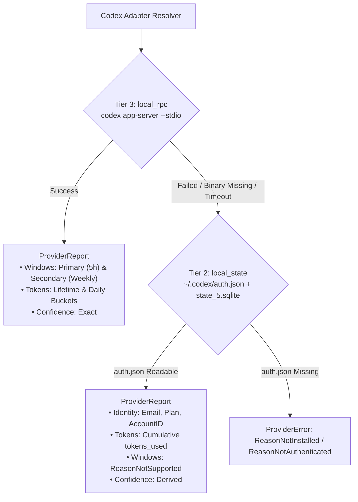

# Codex Adapter Research (DIP-10 Spike)

**Date**: 2026-08-29  
**Version Researched**: Codex CLI `0.148.0` (`codex-cli 0.148.0`) on macOS Darwin arm64 / Linux x86_64  

---

## 1. Executive Summary

Codex CLI (`codex-cli 0.148.0`) exposes quota numbers and usage telemetry in its interactive TUI, but discovering a non-interactive, third-party readable surface without relying on browser cookie extraction or active inference session mutation has been historically unsettled.

A systematic investigation into `codex-cli 0.148.0` evaluated five candidate surfaces:
1. **`codex app-server` (JSON-RPC 2.0)**: **Primary recommendation (Tier 3: `local_rpc`)**. Running `codex app-server --stdio` exposes structured, stateless JSON-RPC endpoints:
   - `account/rateLimits/read`: returns exact primary (5-hour / 300 min) and secondary (weekly / 10,080 min) rate limit quota windows, percentage used, reset epoch timestamps, plan type (`plus`, `pro`, `team`, `enterprise`), and credit balances.
   - `account/usage/read`: returns lifetime token consumption, peak daily tokens, and daily token usage buckets.
   - `account/read`: returns authenticated account email and subscription tier.
   The process can be executed via stdio as a one-shot child process that exits cleanly upon closing stdin, consuming **zero model tokens** and requiring no long-lived daemon.
2. **Session Rollout Files & SQLite Thread Stores**: **Fallback recommendation (Tier 2: `local_state`)**.
   - `~/.codex/sessions/` contains legacy session transcript files without quota window headers.
   - `~/.codex/state_5.sqlite` maintains a `threads` table with `tokens_used INTEGER` per session, allowing cumulative token counting across sessions.
   - Combined with `~/.codex/auth.json` (implemented in DIP-9), local state provides identity, plan claims, and cumulative token metrics, while reporting quota windows as `ReasonNotSupported`.
3. **`codex mcp-server`**: **Ruled out**. Exposes only inference tools (`codex`, `codex-reply`) without usage or rate-limit inspection tools or MCP resources. Calling these tools initiates LLM inference and consumes user quota.
4. **Direct OpenAI REST Endpoints with OAuth `access_token`**: **Ruled out for rate limits**. The OAuth access token in `~/.codex/auth.json` has client scopes limited to `['openid', 'profile', 'email', 'offline_access', 'api.connectors.read', 'api.connectors.invoke']`. While `GET https://api.openai.com/v1/me` succeeds for basic user metadata, developer usage and billing endpoints (`/v1/organization/usage`, `/v1/dashboard/billing/subscription`) fail with `401 Unauthorized` / `403 Forbidden`.
5. **SQLite Logs (`~/.codex/logs_2.sqlite`)**: **Ruled out**. Stores application diagnostic and OpenTelemetry trace logs only.

---

## 2. Filesystem & Configuration Layout

Codex resolves its state directory from `$CODEX_HOME` (defaulting to `~/.codex/`):

| Path | Purpose | Stability |
|---|---|---|
| `~/.codex/auth.json` | OAuth tokens (`id_token`, `access_token`, `refresh_token`, `account_id`) or `OPENAI_API_KEY` | Stable (Tier 2 Identity) |
| `~/.codex/config.toml` | User configuration (model preferences, sandboxing, analytics) | Stable |
| `~/.codex/state_5.sqlite` | Thread metadata, session history index, and `tokens_used` per thread | Internal State |
| `~/.codex/thread_history_1.sqlite` | Paginated thread turns and items | Internal State |
| `~/.codex/sessions/` | Flat JSON transcripts (`rollout-*.json`) | Legacy / migrating |
| `~/.codex/logs_2.sqlite` | Tracing and diagnostic logs | Internal Logs |

---

## 3. Candidate 1: `codex app-server` (Primary Recommendation)

### Architecture & Transports

`codex app-server` is an experimental JSON-RPC 2.0 server built into the Codex CLI.
- **Transports**: `--listen stdio://` (default with `--stdio`), `unix://<path>`, `ws://<ip>:<port>`.
- **Schema Reflection**: Protocol schemas and TypeScript bindings can be generated dynamically:
  - `codex app-server generate-json-schema --out <dir>`
  - `codex app-server generate-ts --out <dir>`
- **Stateless Execution**: When invoked as `codex app-server --stdio` as a subprocess, Dipstick can send an `initialize` request followed by `account/rateLimits/read` and `account/usage/read`, then terminate the process or close stdin. No background daemon or socket is leaked.

### Protocol Flow

```
Dipstick Client                      codex app-server --stdio
       |                                       |
       | ------ initialize request ----------> |
       | <----- initialize response ---------- |
       |                                       |
       | -- account/rateLimits/read req -----> |
       | <--- rateLimits response (JSON) ----- |
       |                                       |
       | ---- account/usage/read req --------> |
       | <----- usage response (JSON) -------- |
       |                                       |
       | ---- (close stdin / terminate) -----> |
```

### Captured Sample Payloads (`codex-cli 0.148.0`)

#### Handshake: `initialize`
**Request:**
```json
{
  "jsonrpc": "2.0",
  "id": 1,
  "method": "initialize",
  "params": {
    "clientInfo": {
      "name": "dipstick",
      "version": "0.1.0"
    },
    "capabilities": {}
  }
}
```

**Response:**
```json
{
  "id": 1,
  "result": {
    "userAgent": "dipstick/0.148.0 (Mac OS 26.2.0; arm64) iTerm.app/3.6.11 (dipstick; 0.1.0)",
    "codexHome": "/Users/matt/.codex",
    "platformFamily": "unix",
    "platformOs": "macos"
  }
}
```

#### Rate Limits: `account/rateLimits/read`
**Request:**
```json
{
  "jsonrpc": "2.0",
  "id": 2,
  "method": "account/rateLimits/read"
}
```

**Response:**
```json
{
  "id": 2,
  "result": {
    "rateLimits": {
      "limitId": "codex",
      "limitName": null,
      "primary": {
        "usedPercent": 0,
        "windowDurationMins": 300,
        "resetsAt": 1788064418
      },
      "secondary": {
        "usedPercent": 0,
        "windowDurationMins": 10080,
        "resetsAt": 1788651218
      },
      "credits": {
        "hasCredits": false,
        "unlimited": false,
        "balance": "0"
      },
      "individualLimit": null,
      "spendControlReached": false,
      "planType": "plus",
      "rateLimitReachedType": null
    },
    "rateLimitsByLimitId": {
      "codex": {
        "limitId": "codex",
        "limitName": null,
        "primary": {
          "usedPercent": 0,
          "windowDurationMins": 300,
          "resetsAt": 1788064418
        },
        "secondary": {
          "usedPercent": 0,
          "windowDurationMins": 10080,
          "resetsAt": 1788651218
        },
        "credits": {
          "hasCredits": false,
          "unlimited": false,
          "balance": "0"
        },
        "individualLimit": null,
        "spendControlReached": false,
        "planType": "plus",
        "rateLimitReachedType": null
      }
    },
    "rateLimitResetCredits": {
      "availableCount": 1,
      "credits": [
        {
          "id": "RateLimitResetCredit_cd8e859d3d0c819180b5ed7e4751815c",
          "resetType": "codexRateLimits",
          "status": "available",
          "grantedAt": 1787356189,
          "expiresAt": 1789948189,
          "title": "Full reset (Weekly + 5 hr)",
          "description": "Thanks for using Codex! You've been granted one free rate limit reset."
        }
      ]
    }
  }
}
```

#### Token Usage: `account/usage/read`
**Request:**
```json
{
  "jsonrpc": "2.0",
  "id": 3,
  "method": "account/usage/read"
}
```

**Response:**
```json
{
  "id": 3,
  "result": {
    "summary": {
      "lifetimeTokens": 44535901,
      "peakDailyTokens": 19503139,
      "longestRunningTurnSec": 622,
      "currentStreakDays": 0,
      "longestStreakDays": 3
    },
    "dailyUsageBuckets": [
      {"startDate": "2026-02-23", "tokens": 6269751},
      {"startDate": "2026-03-03", "tokens": 3130282},
      {"startDate": "2026-08-19", "tokens": 14702029},
      {"startDate": "2026-08-20", "tokens": 824373},
      {"startDate": "2026-08-21", "tokens": 75205},
      {"startDate": "2026-08-24", "tokens": 19503139},
      {"startDate": "2026-08-27", "tokens": 31122}
    ],
    "threadUsage": null
  }
}
```

#### Account Identity: `account/read`
**Request:**
```json
{
  "jsonrpc": "2.0",
  "id": 4,
  "method": "account/read",
  "params": {}
}
```

**Response:**
```json
{
  "id": 4,
  "result": {
    "account": {
      "type": "chatgpt",
      "email": "user@example.com",
      "planType": "plus"
    },
    "requiresOpenaiAuth": true
  }
}
```

---

## 4. Candidate 2: Session Rollout Files & Local SQLite State (Fallback Recommendation)

### Rollout Files (`~/.codex/sessions/`)
- Audit across 476 session rollout files in `~/.codex/sessions/*.json` shows event items restricted to `reasoning`, `message`, `function_call`, and `function_call_output`.
- Rollouts do **not** record sliding rate-limit windows, window durations, or reset timestamps.
- Codex is actively migrating thread history to `thread_history_1.sqlite`.

### SQLite State Store (`~/.codex/state_5.sqlite`)
The `threads` table maintains per-thread token telemetry:
```sql
CREATE TABLE threads (
    id TEXT PRIMARY KEY,
    rollout_path TEXT NOT NULL,
    created_at INTEGER NOT NULL,
    updated_at INTEGER NOT NULL,
    source TEXT NOT NULL,
    model_provider TEXT NOT NULL,
    cwd TEXT NOT NULL,
    title TEXT NOT NULL,
    sandbox_policy TEXT NOT NULL,
    approval_mode TEXT NOT NULL,
    tokens_used INTEGER NOT NULL DEFAULT 0,
    ...
);
```

- Querying `SELECT SUM(tokens_used) FROM threads;` yields the local cumulative token usage across all recorded threads (e.g. `41,586,505` tokens).
- When combined with `~/.codex/auth.json` (which provides JWT-derived email, plan, and account ID), local state acts as a robust Tier 2 fallback without requiring binary execution or network connectivity.

---

## 5. Candidate 3: `codex mcp-server` (Audit Findings)

Invoking `codex mcp-server` initiates a Model Context Protocol server over stdio.
- **Capabilities**: Declares only `{"tools": {"listChanged": true}}` (no resources or prompts).
- **Tools Exposed**:
  1. `codex`: Runs a full interactive Codex session with user prompts and shell execution policies.
  2. `codex-reply`: Continues an existing Codex conversation thread.
- **Verdict**: `mcp-server` has no usage inspection endpoints. Triggering tool calls invokes LLM generation and spends quota. **Ruled out**.

---

## 6. Candidate 4: OpenAI REST API with OAuth `access_token` (Audit Findings)

`~/.codex/auth.json` contains a JWT `access_token` issued by `https://auth.openai.com` with audience `["https://api.openai.com/v1"]` and scopes:
`['openid', 'profile', 'email', 'offline_access', 'api.connectors.read', 'api.connectors.invoke']`

Testing standard OpenAI REST endpoints with this bearer token yielded:
- `GET https://api.openai.com/v1/me` -> `200 OK` (User ID, created timestamp, profile metadata).
- `GET https://api.openai.com/v1/models` -> `403 Forbidden` (`Missing scopes: api.model.read`).
- `GET https://api.openai.com/v1/organization/usage` -> `404 Not Found`.
- `GET https://api.openai.com/v1/usage` -> `401 Unauthorized` (`Incorrect API key provided`).
- `GET https://api.openai.com/v1/dashboard/billing/subscription` -> `401 Unauthorized`.

**Verdict**: The OAuth token is strictly a consumer ChatGPT/Codex token without developer platform API scopes. Direct HTTP queries to OpenAI developer usage endpoints are unsupported. **Ruled out**.

---

## 7. Candidate 5: SQLite Logs (`~/.codex/logs_2.sqlite`) (Audit Findings)

`~/.codex/logs_2.sqlite` contains application diagnostic events (`_sqlx_migrations`, `logs`).
- Log lines record module paths, trace IDs, log levels (`INFO`, `TRACE`, `ERROR`), and HTTP client certificate logging.
- Contains no token counters, rate-limit windows, or usage breakdowns. **Ruled out**.

---

## 8. Recommended Source Ladder for Codex



### Source Tier Definitions

1. **Tier 3 (`local_rpc`) — Primary Rung**:
   - Spawn `codex app-server --stdio` using `internal/cliexec.Runner` with a 5-second execution timeout.
   - Handshake with `initialize`.
   - Call `account/rateLimits/read` to obtain:
     - `primary`: 5-hour window (`windowDurationMins: 300`), `usedPercent`, `resetsAt` (converted to `time.Time`).
     - `secondary`: 7-day window (`windowDurationMins: 10080`), `usedPercent`, `resetsAt`.
     - `credits`: credit balance and status.
   - Call `account/usage/read` to populate `dipstick.TokenUsage` (`LifetimeTokens`, `DailyBuckets`).
   - Call `account/read` to confirm identity and plan tier (`plus`, `pro`, `team`, etc.).
   - Report with `types.ConfidenceExact`.
2. **Tier 2 (`local_state`) — Fallback Rung**:
   - Parse `~/.codex/auth.json` (via existing `internal/adapters/codex/jwt.go`).
   - Query `~/.codex/state_5.sqlite` for `SELECT SUM(tokens_used) FROM threads;`.
   - Report identity, cumulative tokens, and mark `Windows` as `ReasonNotSupported` (or unmetered if in API key mode).
   - Report with `types.ConfidenceDerived`.

---

## 9. Schema Mapping into `dipstick.v1`

| Codex `app-server` Field | Dipstick Domain Model (`internal/types`) | Mapping / Notes |
|---|---|---|
| `rateLimits.primary.usedPercent` | `RateWindow.UsedPercent` | Float pointer (e.g. `0.0` to `100.0`) |
| `rateLimits.primary.windowDurationMins` | `RateWindow.WindowDurationSeconds` | `300 * 60` = `18000` (5 hours) |
| `rateLimits.primary` | `RateWindow.Label` | `"5h"` or `"primary"` |
| `rateLimits.primary.resetsAt` | `RateWindow.ResetsAt` | Epoch seconds -> `time.Unix(s, 0).UTC()` |
| `rateLimits.secondary.usedPercent` | `RateWindow.UsedPercent` | Float pointer for weekly window |
| `rateLimits.secondary.windowDurationMins` | `RateWindow.WindowDurationSeconds` | `10080 * 60` = `604800` (7 days) |
| `rateLimits.secondary` | `RateWindow.Label` | `"weekly"` or `"secondary"` |
| `rateLimits.secondary.resetsAt` | `RateWindow.ResetsAt` | Epoch seconds -> `time.Unix(s, 0).UTC()` |
| `rateLimits.planType` | `Identity.Plan` | `"plus"`, `"pro"`, `"team"`, etc. |
| `account.email` | `Identity.Email` | Extracted from `account/read` |
| `summary.lifetimeTokens` | `TokenUsage.TotalTokens` | Total lifetime token consumption |
