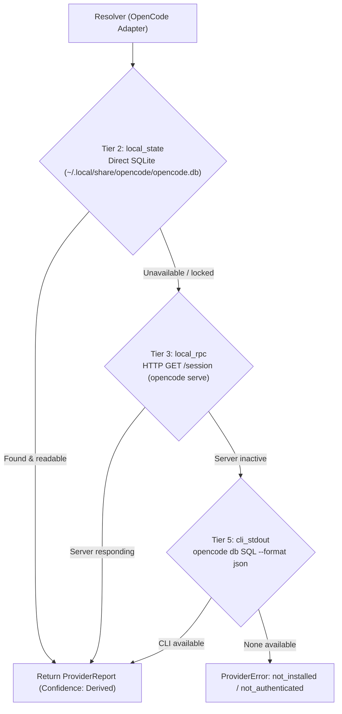

# OpenCode Adapter Research (DIP-11 Spike)

**Date**: 2026-08-29  
**Version Researched**: OpenCode `v1.18.20` (`anomalyco/opencode`) on macOS Darwin arm64 / Linux x86_64  

---

## 1. Executive Summary

OpenCode is an open-source, BYO-provider ("Bring Your Own Provider") agentic coding harness. Unlike single-vendor agents (e.g. Claude Code), OpenCode allows users to route tasks across 75+ AI model providers (Anthropic, OpenAI, OpenRouter, Google, Ollama, Hugging Face, etc.).

A complete audit of OpenCode `v1.18.20`'s CLI, filesystem, SQLite database, HTTP server mode, and open-source architecture confirms that **OpenCode exposes a comprehensive, high-fidelity local usage surface**.

Specifically:
1. **Local State (Tier 2)**: OpenCode maintains a central SQLite database (`~/.local/share/opencode/opencode.db`) tracking exact token counts (`tokens_input`, `tokens_output`, `tokens_reasoning`, `tokens_cache_read`, `tokens_cache_write`), cumulative cost, timestamps, and model/provider attribution per session and per message.
2. **Server Mode / RPC (Tier 3)**: Running `opencode serve` exposes REST endpoints (e.g. `GET /session`, `GET /session/:sessionID/message`) that return structured JSON session summaries and per-turn token metrics.
3. **CLI Query Surface (Tier 5)**: `opencode db "<SQL>" --format json` enables non-interactive, structured JSON querying directly over the local state without interactive TUI prompts.

---

## 2. Filesystem & Configuration Layout

OpenCode adheres strictly to the **XDG Base Directory Specification** on both Linux and macOS via the `xdg-basedir` library. macOS does **not** use `~/Library/Application Support/` or `~/Library/Caches/`.

| Component | Standard Path (macOS & Linux) | Environment Override | Purpose |
|---|---|---|---|
| **Data Directory** | `~/.local/share/opencode/` | `$XDG_DATA_HOME/opencode` | SQLite database, auth credentials, logs, project repos |
| **Database** | `~/.local/share/opencode/opencode.db` | — | Central SQLite database (Drizzle ORM) |
| **Credentials** | `~/.local/share/opencode/auth.json` | `OPENCODE_AUTH_CONTENT` | API keys and OAuth tokens per provider |
| **Config Directory** | `~/.config/opencode/` | `$XDG_CONFIG_HOME/opencode` or `$OPENCODE_CONFIG_DIR` | Global configuration (`opencode.json`, `opencode.jsonc`) |
| **Cache Directory** | `~/.cache/opencode/` | `$XDG_CACHE_HOME/opencode` | Downloaded binaries, temporary cache |
| **State Directory** | `~/.local/state/opencode/` | `$XDG_STATE_HOME/opencode` | Runtime lockfiles and ephemeral state |
| **Logs** | `~/.local/share/opencode/log/` | — | Application logs |

Project-level configurations are also resolved upwards from the current working directory to the git worktree root via `.opencode/` or `opencode.json`.

---

## 3. Local State & Database Schema

The primary SQLite database at `~/.local/share/opencode/opencode.db` contains 21 tables. The most relevant tables for token and usage accounting are `session` and `session_message` (legacy `message` and `part`).

### `session` Table Schema
```sql
CREATE TABLE `session` (
  `id` text PRIMARY KEY,
  `project_id` text NOT NULL,
  `workspace_id` text,
  `parent_id` text,
  `slug` text NOT NULL,
  `directory` text NOT NULL,
  `path` text,
  `title` text NOT NULL,
  `version` text NOT NULL,
  `share_url` text,
  `summary_additions` integer,
  `summary_deletions` integer,
  `summary_files` integer,
  `summary_diffs` text,
  `metadata` text,
  `cost` real DEFAULT 0 NOT NULL,
  `tokens_input` integer DEFAULT 0 NOT NULL,
  `tokens_output` integer DEFAULT 0 NOT NULL,
  `tokens_reasoning` integer DEFAULT 0 NOT NULL,
  `tokens_cache_read` integer DEFAULT 0 NOT NULL,
  `tokens_cache_write` integer DEFAULT 0 NOT NULL,
  `revert` text,
  `permission` text,
  `agent` text,
  `model` text, -- JSON: {"id":"<model_id>","providerID":"<provider_id>","variant":"..."}
  `time_created` integer NOT NULL, -- Unix ms
  `time_updated` integer NOT NULL, -- Unix ms
  `time_compacting` integer,
  `time_archived` integer,
  CONSTRAINT `fk_session_project_id_project_id_fk` FOREIGN KEY (`project_id`) REFERENCES `project`(`id`) ON DELETE CASCADE
);
```

### `session_message` Table
Stores chronological message turns for each session:
- `id`: Message identifier (`msg_...`)
- `session_id`: Foreign key to `session.id`
- `type`: `user`, `assistant`, `system`, `shell`, `compaction`, etc.
- `data`: JSON payload. For `type = "assistant"`, contains:
  ```json
  {
    "type": "assistant",
    "agent": "build",
    "model": {
      "id": "claude-3-7-sonnet",
      "providerID": "anthropic"
    },
    "tokens": {
      "input": 1420,
      "output": 350,
      "reasoning": 128,
      "cache": {
        "read": 8400,
        "write": 1200
      }
    },
    "cost": 0.0452,
    "time": {
      "created": 1724961234000,
      "completed": 1724961239000
    }
  }
  ```

---

## 4. Provider & Upstream Model Attribution

OpenCode explicitly preserves **provider and model attribution** across multiple layers:
1. **Per-Session Attribution**: `session.model` records the active `{ id: string, providerID: string, variant?: string }` (e.g. `{"id":"claude-3-7-sonnet","providerID":"anthropic"}`).
2. **Per-Message Attribution**: Every assistant turn in `session_message` records the exact `providerID` and `model.id` used for that specific inference call. If a user switches models during a session (or uses multiple agents configured with different providers), token counts are tracked per assistant step without losing provider provenance.

---

## 5. Server Mode & HTTP API Surface

`opencode serve` runs a local HTTP/JSON service (defaulting to `127.0.0.1:<port>`):
- `GET /session`: Lists all sessions, including cumulative `tokens` (`input`, `output`, `reasoning`, `cache.read`, `cache.write`), `cost`, `model`, and timestamps.
- `GET /session/:sessionID/message`: Returns the full transcript of messages with per-turn token usage and model metadata.
- `GET /provider`: Returns all registered/configured AI providers and models.

---

## 6. CLI Command Audit

| Command | Non-Interactive JSON? | Token Data Present? | Suitability for Adapter |
|---|---|---|---|
| `opencode stats` | No (ANSI text / tables only) | Yes (aggregate tokens, cost, model breakdown) | Requires scraping; brittle |
| `opencode db "<SQL>" --format json` | **Yes** | **Yes** (direct query of any table) | **High** (Tier 5 fallback) |
| `opencode session list --format json` | Yes | No (IDs, titles, timestamps only) | Useful for session discovery |
| `opencode export <sessionID>` | Yes (requires session ID) | Yes (full transcript) | Useful for transcript parsing |

---

## 7. Recommended Source Ladder for OpenCode



1. **Tier 2 (`local_state`)**: Primary rung. Query `~/.local/share/opencode/opencode.db` directly using a pure-Go SQLite reader.
   - Aggregate query:
     ```sql
     SELECT 
       SUM(tokens_input) AS input_tokens,
       SUM(tokens_output) AS output_tokens,
       SUM(tokens_reasoning) AS reasoning_tokens,
       SUM(tokens_cache_read) AS cache_read_tokens,
       SUM(tokens_cache_write) AS cache_write_tokens
     FROM session;
     ```
2. **Tier 3 (`local_rpc`)**: If `opencode serve` is running on a known port or discovered via local state, query `GET /session`.
3. **Tier 5 (`cli_stdout`)**: Execute `opencode db "SELECT ..." --format json` to query SQLite non-interactively via the CLI.

---

## 8. Schema Impact on `ProviderReport` (`dipstick.v1`)

- **Top-Level Metrics**: OpenCode's aggregate token counters map 1:1 to `dipstick.TokenUsage` (`InputTokens`, `OutputTokens`, `CacheReadTokens`, `CacheWriteTokens`). Total tokens can be honestly reported with `Confidence: ConfidenceDerived`.
- **Sub-Provider Dimension**: Because OpenCode is multi-provider, aggregating all tokens into a single report combines disparate pricing/quota models. Under `dipstick.v1`'s additive compatibility promise, an optional `Models` or `SubProviders` slice can be added additively to `ProviderReport` in a future minor revision without breaking v1 consumers. For v0.1, the aggregate `Tokens` with `ConfidenceDerived` is fully supported.
